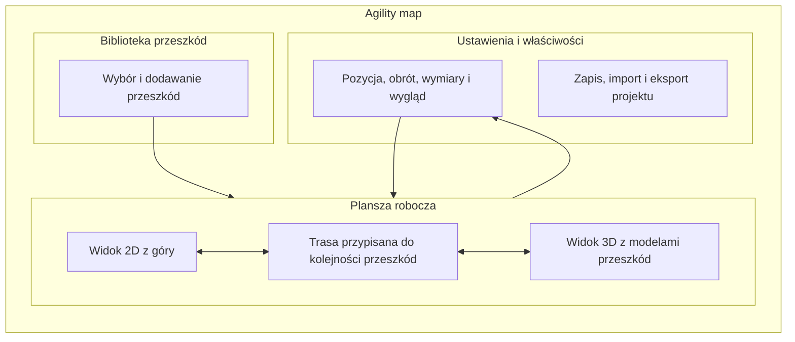

# Agility map

Przeglądarkowy edytor do układania torów agility dla psów. Pozwala rozmieścić przeszkody na planie z góry, edytować przebieg trasy i obejrzeć układ w przestrzennym widoku 3D.

**[Otwórz Agility map](https://damiano999.github.io/Agility/)** · Aplikacja działa w przeglądarce i nie wymaga instalacji.

## Jak wygląda aplikacja

Edytor składa się z biblioteki przeszkód po lewej stronie, planszy roboczej pośrodku i panelu właściwości po prawej. Na telefonie te panele otwierają się z dolnego paska, a plansza pozostaje główną częścią ekranu.



## Funkcje

- Edycja planszy w widoku 2D i nawigacja po scenie 3D.
- Przesuwanie i obracanie przeszkód oraz automatyczne aktualizowanie trasy zgodnie z ich kolejnością. Przebieg uwzględnia osie przeszkód, tyczki slalomu i krzywiznę tunelu.
- Losowanie toru z wyborem liczby przeszkód (do 20) i rodzaju układu.
- Regulowana długość i kształt tunelu otwartego, pomiar odległości między kolejnymi przeszkodami oraz ustawienia planszy.
- Zapisywanie projektu w pamięci przeglądarki, import i eksport JSON oraz pobieranie planszy jako PNG.
- Samouczek, zasady korzystania i polityka prywatności dostępne w aplikacji.
- Układ responsywny dla telefonów i komputerów.

Wymiary przeszkód odzwierciedlają wartości regulaminowe tam, gdzie są określone. Na przykład kładka ma około 10,5 m, slalom ma 12 tyczek w odstępach 60 cm, a otwarty tunel ma średnicę około 60 cm i długość 3–6 m. Szczegóły mogą zależeć od klasy zawodów i aktualnego regulaminu; losowy układ warto zweryfikować przed treningiem lub zawodami. [Regulamin FCI](https://www.fci.be/medias/FCI-AGI-DIR-OBS-17043.pdf).

## Uruchamianie lokalne

To statyczna aplikacja bez procesu build. Uruchom lokalny serwer HTTP w katalogu projektu, np.:

```bash
python -m http.server 8000
```

Następnie otwórz `http://localhost:8000`. Moduły JavaScript nie działają poprawnie otwierane bezpośrednio jako plik `file://`. Widok 3D korzysta z Three.js ładowanego z jsDelivr i wymaga połączenia z internetem oraz obsługi WebGL.

## Struktura projektu

```text
.
├── index.html              # Struktura strony i okna dialogowe
├── README.md               # Opis aplikacji i instrukcja uruchamiania
├── assets/
│   └── obstacles/          # Przezroczyste grafiki przeszkód PNG
└── src/
    ├── app.js              # Stan edytora, interakcje, zapis i eksport
    ├── obstacle-icons.js   # Ikony 2D, obrysy i geometria planszy
    ├── scene-3d.js         # Modele przeszkód i interaktywny widok 3D
    └── styles.css          # Układ, responsywność i style
```

Projekty i ustawienia są przechowywane lokalnie w przeglądarce. Aplikacja nie wymaga konta ani własnego serwera API.
